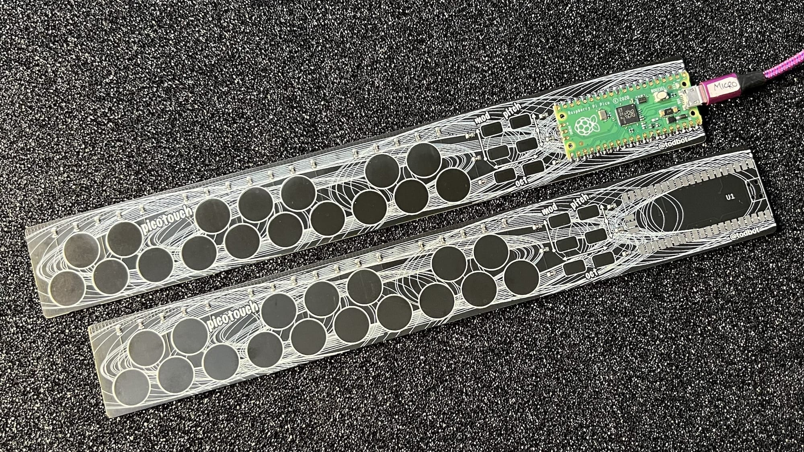
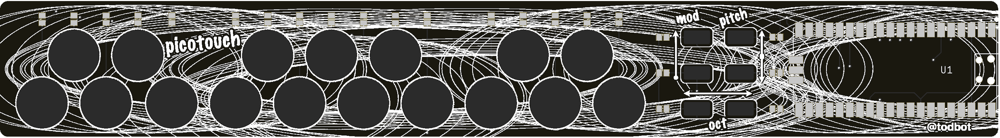
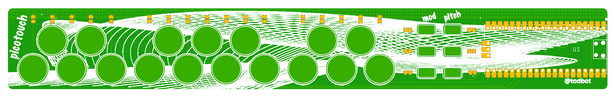

# picotouch

Tiny capsense touch USB MIDI keyboard from a Raspberry Pi Pico




<a href="https://www.tindie.com/products/todbot/picotouch-capsense-midi-keyboard-for-raspi-pico/"></a>


If you're looking for the synthesizer version,
that's at [github.com/todbot/picotouch_synth](https://github.com/todbot/picotouch_synth)

## Demos


https://user-images.githubusercontent.com/274093/216477797-90a1e4ca-b68f-4eb2-be46-de1d6d81551e.mp4


Also see videos in this Twitter thread : https://twitter.com/todbot/status/1382469033061093377

And check out [picotouch videos on my Youtube channel](https://www.youtube.com/@todbot/search?query=picotouch)

## Materials needed

If you [buy a black 'picotouch SMD' board from my Tindie store](https://www.tindie.com/products/todbot/picotouch-capsense-midi-keyboard-for-raspi-pico/), the <b>resistors are soldered</b> for you, so you only need to
[solder the Pico](https://www.youtube.com/watch?v=dW9LiOq3Dso).

If you're building one by hand, you will need:
- 1 - picotouch PCB ([order from OSHpark](https://oshpark.com/shared_projects/5MnI1jPf))
- 1 - Raspberry Pi Pico  (**(NOTE: this board will NOT work with the Pico2, since its RP2350 chip has a hardware error)**
- 23 - 1M ohm 0805 SMD resistors  ([Digikey cart with this & Pico](https://www.digikey.com/short/w381rn4w))


## How to solder the Pico

It's not too bad!  A pretty easy first-time SMD soldering project.  Here's
[how to solder the Pico down](https://www.youtube.com/watch?v=dW9LiOq3Dso).
The technique is: line up the Pico solder one corner, solder the other, then finish all the rest.
In the video you see I don't get it aligned perfectly straight (hard to see around the camera), but it still works great!  ([Youtube version of the below video](https://www.youtube.com/watch?v=dW9LiOq3Dso))

https://user-images.githubusercontent.com/274093/217670870-b04d55ed-e37d-4be2-bea7-4985d2b3f8c4.mp4


## Firmware Installation

* Install CircuitPython
  - Hold down BOOT button while plugging in Pico to get RPI-RP2 drive
  - Download CircuitPython UF2 from https://circuitpython.org/board/raspberry_pi_pico/
  - Drag UF2 to RPI-RP2 drive. CircuitPython is now installed!

* Install CircuitPython libraries onto Pico
  - If you have Python on your computer you can do:
    ```
    pip3 install circup
    circup install adafruit_midi adafruit_debouncer adafruit_ticks
    ```
  - Otherwise, download the CircuitPython Libraries Bundle at https://circuitpython.org/libraries
    and copy over the `adafruit_midi`, `adafruit_debouncer`, & `adafruit_ticks` libraries
    to the `CIRCUITPY/lib` folder on the Pico.

* Install picotouch `code.py`
  - Via commandline:
    ```
    cp picotouch/circuitpython/picotouch/code.py /Volumes/CIRCUITPY/code.py
    ```
  - Or you can drag-n-drop using your computer's GUI
  - Note: this will delete the previous `code.py` on your Pico.
      Normally this is fine, but if it's not, be sure to save it if you want to keep it!


## Going further

There's other things you can do with the picotouch board.

- Use it as a MIDI slider bank

    Install
   [`picotouch_midislider/code.py`](https://github.com/todbot/picotouch/blob/main/circuitpython/picotouch_midislider/code.py) instead of the regular picotouch code.py.

   - youtube demo: [midislider demo video](https://youtu.be/1Psw3PLqYS8)

- Use it as a HID keyboard macropad

   - example code: [`picotouch_macropad/code.py`](https://github.com/todbot/picotouch/blob/main/circuitpython/picotouch_macropad/code.py)

   It's early days, but it's a start at that idea


## Press

- https://www.hackster.io/news/tod-kurt-s-ultra-slim-picotouch-is-a-button-free-23-key-raspberry-pi-pico-powered-midi-keyboard-700a3ce2227b (26 Feb 2023)
- https://www.raspberrypi.com/news/picotouch-synthesiser-magpimonday/ (22 Nov 2023)
